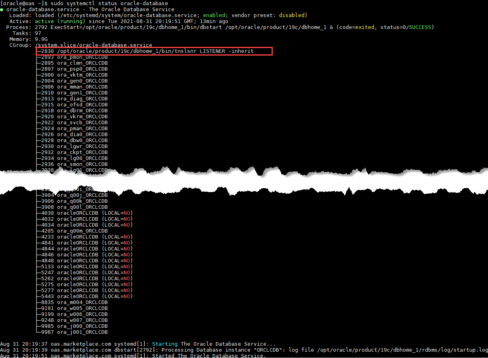
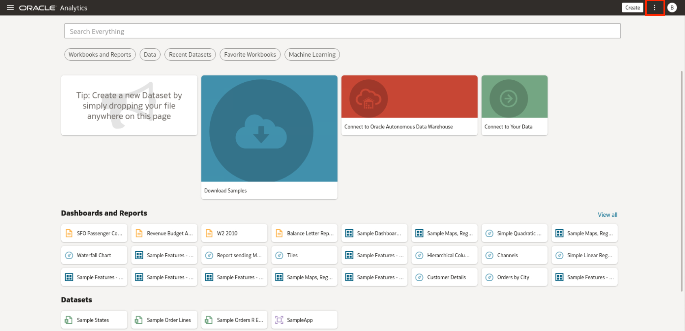
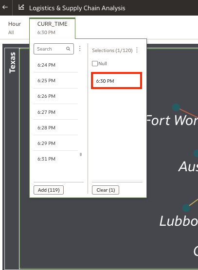
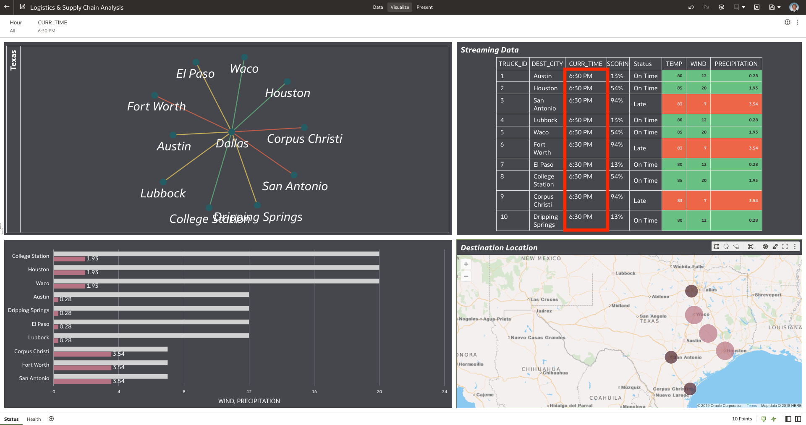
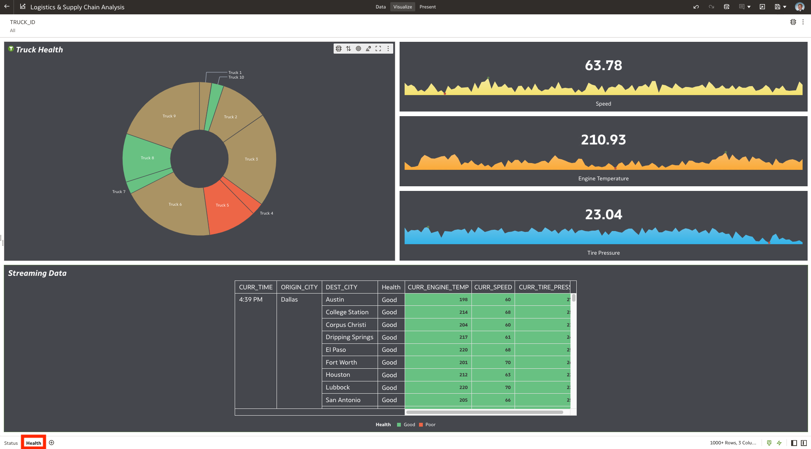
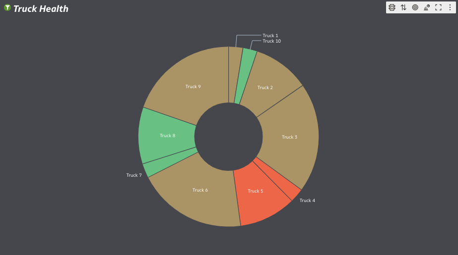
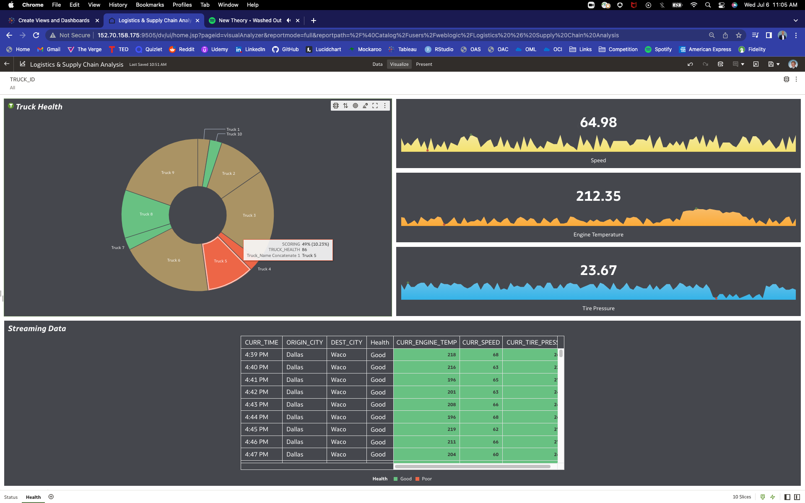
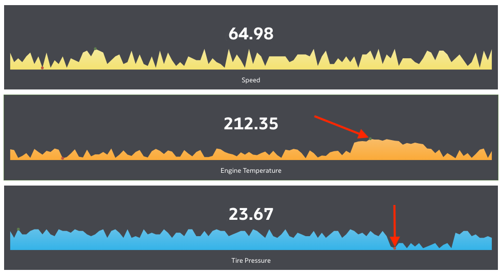

# Oracle Analytics

## Introduction

This lab provides detailed instructions of connecting to Oracle Analytics Server (OAS). This compute instance comes with OAS installed and configured with Oracle database, both managed using Unix/Linux *systemd* services to automatically start and shutdown as required. By the end, this exercise will introduce you to the key features of data visualization within Oracle Analytics Server and will help to tell a story on what is happening with our Trucks, a fictional package delivery company in Texas.

*Estimated Completion Time:* 30 Minutes

### About Oracle Analytics Server

Oracle Analytics Server features powerful, intuitive data visualization capabilities that enable analysts to create self-service data visualizations on an accurate and consistent data set.

### Objectives

- Validate that the environment has been initialized and is ready
<if type="external">- Download and stage workshop artifacts (*Only needed if not using the remote desktop*)</if>

In this lab, you will analyze two dashboards, Status and Health, that will demonstrate real time integration as a data product.

Our Trucks is facing issues with supply chain and logistics, due to the harsh weather conditions. Having the ability to do cross pillar data analysis with non-oracle data provides the ability to perform a deeper dive to identify root causes.

In this scenario we will monitor the weathers impact on our trucks through the creation of dashboards and canvases to quickly find insights:
* **Analyze Package Status:**
    - Net Sales in Northeast region performing lower than other geographies.
    - On Time Delivery performance lagging in Distribution Centers.
* **Analyze Truck Health:**
    - **OTD Analysis** – “The Pennsylvania Distribution Center appears to be driving the shortage of fries, hampering sales in the Northeast region.”
    - **Headcount Analysis** – “Long Wait Times is an indicator that there might be turnover that is affecting payroll costs and customer satisfaction.”

The following files <if type="external">referenced in [Lab: Initialize Environment](?lab=initialize-environment) should already be downloaded and staged as instructed, as they</if> <if type="desktop"> staged under *`/opt/oracle/stage`*</if> are required to complete this lab.

Navigate to the documents directory on the left side of the dialogue box and open **Real Time Integration Labs Content** directory to find the files needed for the lab. The file, **Logistics & Supply Chain Analysis.dva** will be used in this lab. Login should be listed below!

### Prerequisites

This lab assumes you have:
- A Free Tier, Paid or LiveLabs Oracle Cloud account
- You have completed:
    - Lab: Prepare Setup (*Free-tier* and *Paid Tenants* only)
    - Lab: Environment Setup

## Task 1: Login to Oracle Analytics Server UI
This lab has been designed to be executed end-to-end with any modern browser on your laptop or workstation. Proceed as detailed below to login.

1. Now with access to your remote desktop session, proceed as indicated below to validate your environment before you start executing the subsequent labs. The following Processes should be up and running:

    - Database Listener
        - LISTENER
    - Database Server instance
        - ORCLCDB
    - Oracle Analytics Server (OAS)

2. On the *Web Browser* window on the right preloaded with *OAS Web Console*, click on the *Username* field and select the saved credentials to login. These credentials have been saved within *Web Browser* and are provided below for reference

    - Username

    ```
    <copy>dataint</copy>
    ```

    - Password

    ```
    <copy>Admin123</copy>
    ```

    

3. Confirm successful login. Please note that it takes about 5 minutes after instance provisioning for all processes to fully start.

    

    If successful, the page above is displayed and as a result your environment is now ready.  

    <if type="external">
    **Notes:** If for any reasons you prefer to bypass the remote desktop and access the OAS UI directly from your local computer/workstation, launch your browser to the following URL

    ```
    URL: <copy>http://[your instance public-ip address]:9502/dv/ui</copy>
    e.g: http://xxx.xxx.xxx.xxx:9502/dv/ui
    ```
    </if>

4. If you are still unable to login or the login page is not functioning after reloading the application URL, open a terminal session and proceed as indicated below to validate the services.

    - Database and Listener

    ```
    <copy>
    sudo systemctl status oracle-database
    </copy>
    ```

    

    - Oracle Analytics Server (OAS)

    ```
    <copy>
    /opt/oracle/product/Middleware/Oracle_Home/user_projects/domains/bi/bitools/bin/status.sh
    </copy>
    ```

    

5. If you see questionable output(s), failure or down component(s), restart the corresponding service(s) accordingly

    - Database and Listener

    ```
    <copy>
    sudo sudo systemctl restart oracle-database
    </copy>
    ```

    - Oracle Analytics Server (OAS)

    ```
    <copy>
    sudo sudo systemctl restart oas
    </copy>
    ```

<if type="external">

## Task 2: Download and Stage Workshop Artifacts (*not needed if using the remote desktop*)
In order to run this workshop, you will need a set of files that have been conveniently packaged and stage on the instance for you. If you are bypassing the remote desktop and connecting directly to OAS UI from your local computer/workstation, proceed as indicated below.

1. Download and save to a staging area on your laptop or workstation.
    - [`DM_Real_Time_Integration_Content.zip`](https://objectstorage.us-ashburn-1.oraclecloud.com/p/aLrO2xRW8wG3CP1M0Lj3TTjXPoktlzmBsurAo7qESaJPLK3MkRKA4ch1Hox2NcfC/n/natdsecurity/b/labs-files/o/OAS_Retail_LiveLabs_Content.zip)

2. Uncompress the ZIP archive
</if>

## Appendix 1: Managing Startup Services
Your workshop instance is configured to automatically start all processes needed for the labs. Should you need to stop/start these processes, proceed as shown below from your remote desktop session

1. Database Service (Database and Listener).

    - Start

    ```
    <copy>sudo systemctl start oracle-database</copy>
    ```

    - Stop

    ```
    <copy>sudo systemctl stop oracle-database</copy>
    ```

    - Status

    ```
    <copy>sudo systemctl status oracle-database</copy>
    ```

    - Restart

    ```
    <copy>sudo systemctl restart oracle-database</copy>
    ```

2. Oracle Analytics Server (OAS)

    - Start

    ```
    <copy>sudo systemctl start oas</copy>
    ```

    - Stop

    ```
    <copy>sudo systemctl stop oas</copy>
    ```

    - Status

    ```
    <copy>sudo systemctl status oas</copy>
    ```

    - Restart

    ```
    <copy>sudo systemctl restart oas</copy>
    ```

## Task 3: Data Wrangling
1. From the browser session you started in the  Initialize environment lab, **click** on the **Page Menu** icon located in the upper right-hand corner.

    

2. **Click** on **Import Workbook/Flow...** to upload the file we will be using.

3. **Choose** the **Select File** option and pick the .dva file.

4. **Click** Import. The .dva will be imported to your OAS home page.

5. **Select** the **Logistics & Supply Chain Analysis** icon from under the **Workbooks** section.  

6. You will be presented with two filled canvases. Let’s start visualizing! Here is where we can see all of the logistics and supply chain data that will be working with.

    

Oracle Analytics Server includes its own light weight data preparation capabilities. When you import the spreadsheet, you will navigate to the preparation tab before adding the data to the workbook.  Here you can make some modifications to the data elements or make modifications to your data based upon any recommendations Oracle Analytics knowledge service suggests.  Additionally, you can define a relationship between the subject areas in order to join the data sources for further analysis.

7. **Select** the **Data** tab from the top of the screen to see our connection to our database that holds all the data fed through our pipeline. This data can be schedualed to refresh each data or have a live feed to view the dashboards insights in real time.

    

8. **Select** inspect to look closer at the details in this database connection. As you can see, there are details related to our connection type.

    

## Task 4: Package Analysis
The data visualization capabilities in Oracle Analytics Server are extensive, including things like mapping and filtering. In this exercise we will use both capabilities. **Click** on the Visualization tab to start our analysis.

1. In this first exercise we will look at the status of our packages by region. **Select** the **Status** canvas at the bottom of the screen:

    

2. Observe the mesh visual at the top left of the canvas. You can see all the different destinations across the Texas. This will dynamically change with us as we select the different locations on the map.

    

3. Navigate to the map on the canvas. You can see impact of temperature and rain across the Texas for this day. The larger circles represent warmer temperatures and the darker colors represent more rain.

    

    Right away we can see the correlation to cooler temperatures having more rain. We will dig deeper and find out why that is by **selecting** Fort Worth at the top of the map.

4. As you can see, this changes the rest of the dashboard to only focus on data that includes Dallas to Fort Worth. We can see the real time data coming in each second for that day on the top left, color coded by our status - red being late, green being on time, and yellow being early. We can also see the average wind and rain for the day at the bottom left that aggregates the data for us.

    

5. What we want to do next is use the encompassing filters to look at a single point in time rather than a given location. **Deselect** Fort Worth and navigate to the top left filters to **select** 6:30pm under CURR_TIME to see how all of our packages are doing at the end of the day. We also have the option to drill down by hour.

  
  

6. We can see that our trips San Antonio, Fort Worth, and Corpus Christi are going to be late for the day. This means 30% of our packages are going to be late which is a problem that may be do to the severe rain or even our trucks health. Let's next navigate to the **Health** canvas.

    

## Task 4: Truck Analysis
This next section we will inspect the health of our ten trucks and see how the weather might have impacted the trucks instruments.

1. Notice the wheel at the top left of the dashboard that breaks down the health of our ten different trucks. As you can see the healthy trucks are in green and the ones that may need to be inspected are red or turning close to that color.

    

2. **Select** the **Truck 5**, and notice the dashboard change to represent only that truck in critical health. On the right, we can see the average speed, engine temperature, and tire pressure through out the day. Below we can also see the real time data coming in each second from our sensors on the trucks.

    

3. Notice our measurements for the truck. At the same time towards the end of the day we see a spike in engine temperature and lower tire pressures. This is something to note that most likely impacted our trucks health. To be sure, let's look at the data in the table below

    

    Scroll all the way down to the 6pm time that we were looking at in the previous dashboard and notice all the red.

4. It seems that during this hour our trucks health worsened at the end of the delivery day. This is the same spike and drop we saw in our measurement visuals, demonstrating that our truck is in critical health and needs to be brought into the shop. This also could have a direct impact on the status of our packages being early, on time, or late.

6. In summary, we were able to visualize our truck streaming data coming into **Oracle Analytics** in real time by utilizing its governed and self-service capabilities to build out dashboards to analyze logistics and supply chain management. With these visual insights at the end of our pipeline, a trucking company can now proceed to see relevant issues they are facing to be more efficient with their operations thanks to the help of Oracle’s Data Integration in Data Mesh.

## Learn More
* [Oracle Analytics Server Documentation](https://docs.oracle.com/en/middleware/bi/analytics-server/index.html)
* [https://www.oracle.com/business-analytics/analytics-server.html](https://www.oracle.com/business-analytics/analytics-server.html)
* [https://www.oracle.com/business-analytics](https://www.oracle.com/business-analytics)

## Acknowledgements
* **Authors** - Luke Wheless, Andrew Selius, Solution Engineer, NA Cloud and Technology
* **Contributors** - Luke Wheless, Solution Solution Engineer, NA Cloud and Technology
* **Last Updated By/Date** - Luke Wheless, June 2022
