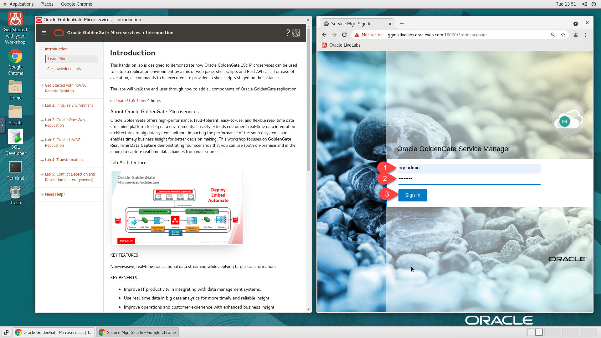
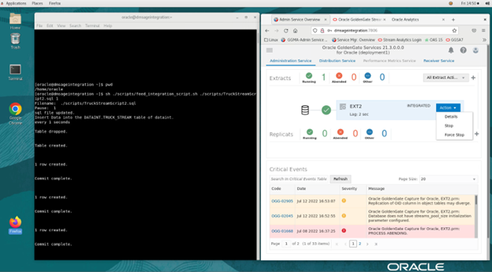
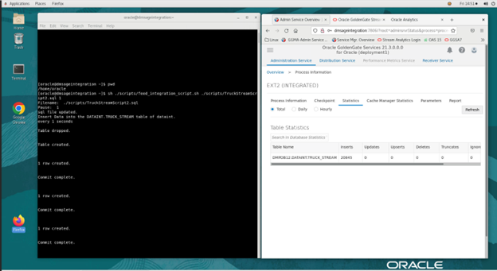

# Setup of GoldenGate Microservices for Replication

## Introduction

This hands-on lab is designed to demonstrate how Oracle GoldenGate 19c Microservices can be used to setup a replication environment by a mix of web page, shell scripts and Rest API interfaces.  

The labs will walk the end-user through how to add components of Oracle GoldenGate replication.

*Estimated Lab Time*: 30 mins

### About Oracle GoldenGate Microservices
Oracle GoldenGate offers high-performance, fault-tolerant, easy-to-use, and flexible real- time data streaming platform for big data environments. It easily extends customers’ real-time data integration architectures to big data systems without impacting the performance of the source systems and enables timely business insight for better decision making. This workshop focuses on **GoldenGate Real Time Data Capture** demonstrating four scenarios that you can use (both on-premise and in the cloud) to capture real time data changes from your sources.

### Lab Architecture


### Objectives

The objectives of the lab is to familiarize you with the process to create data replication objects that will allow you to replicate data realtime using GoldenGate Microservices while levergaring RestfulAPIs.

In this lab we will setup GoldenGate Microservices

## Task 1: Review Deployments Extract – "EXT2"

Deployments are a new concept in Oracle GoldenGate Microservices.
Deployments provide a siloed approach to splitting replication environments between applications, customers, or environments. This allows for greater control over the use of Oracle GoldenGate in larger environments.


**GoldenGate Extracts** define the rules and parameters for replicating data from the Truck Stream Oracle Database real time to load into the GG Stream Architecture

## Task 1: Sign Into GoldenGate Microservices Console

1. On the web browser window on the right preloaded with *Oracle GoldenGate Administrator Manager*, click on the *Username* field and provide the credentials below to login.

    ```
    <copy>

    <copy>oggadmin</copy>
    </copy>
    ```

    ```
    <copy>
    Password: <copy>welcome1</copy>
    </copy>
    ```




2. Confirm successful login. 


3. Review GoldenGate Extract from Database - **Truck Stream**. 




4. Select **Action / Details** from the drop down. 



5. Confirm inserts by selecting **statistics**. 


6. Review parameter file - Table being extracted is DATAINT.TRUCK_STREAM


## Summary
The objectives of the lab was to familiarize you with the process to create data replication objects that will allow you to replicate data real-time using GoldenGate Microservices.

Oracle GoldenGate offers high-performance, fault-tolerant, easy-to-use, and flexible real- time data streaming platform. It easily extends customers’ real-time data integration architectures without impacting the performance of the source systems and enables timely business insight for better decision making.

You may now [proceed to the next lab](#next).

## Learn More

* [GoldenGate Microservices](https://docs.oracle.com/en/middleware/goldengate/core/19.1/understanding/getting-started-oracle-goldengate.html#GUID-F317FD3B-5078-47BA-A4EC-8A138C36BD59)

## Acknowledgements
* **Author** - Brian Elliott, Data Integration, August - 2022
* **Contributors** - 
- **Last Updated By/Date** - Brian Elliott, Data Integration, August - 2022
