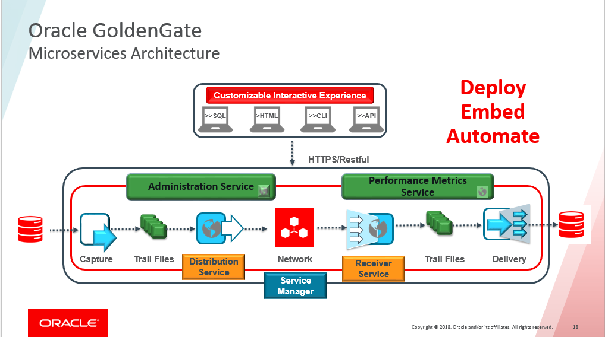
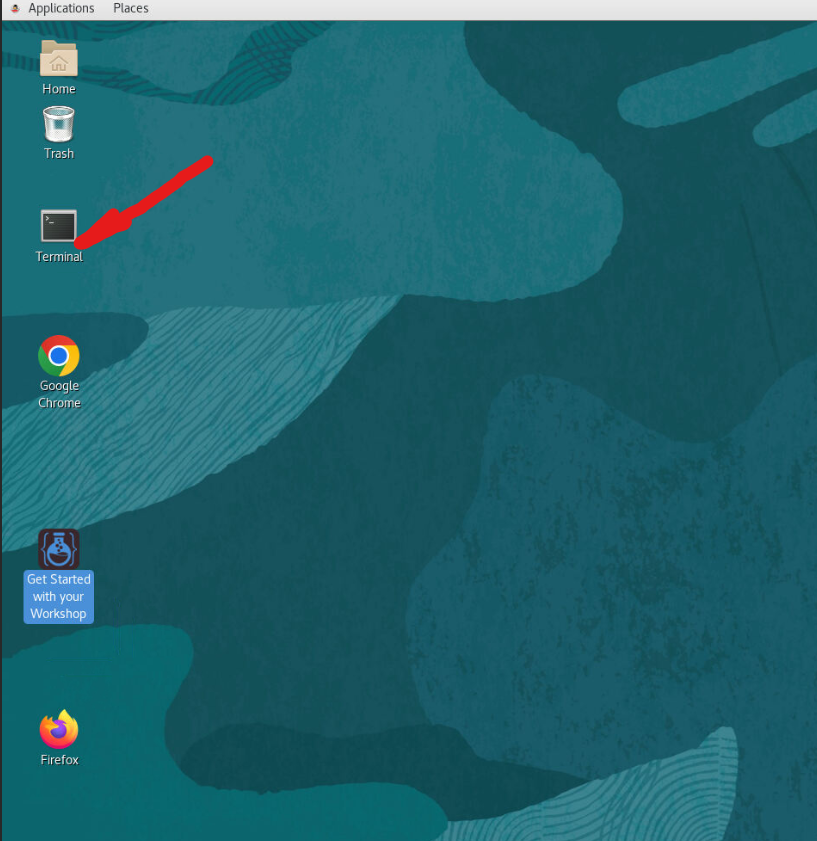
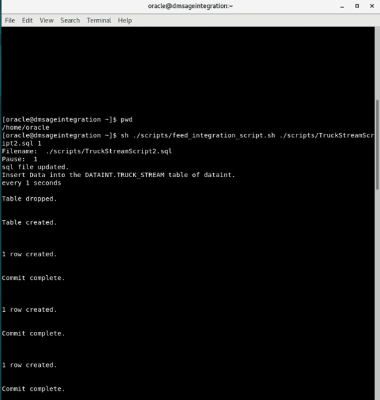

# Initialize Environment

## Introduction
In this lab we will setup the required database and GoldenGate replication users.

*Estimated Lab Time*:  20 minutes

### Lab Architecture


### Objectives
Understanding how to prepare and setup an Oracle Database for replication and define users for replication. Users are created using scripts that populate the multitenant environment with required Oracle Users while applying aliases to be used by GoldenGate. The Database used in this lab are identified in the source and has been already created.


## Task 1: set up environment to populate truck streaming.

1. sign into the data integration server

2. Click on *Terminal* icon on the desktop to start a terminal session





3. [oracle@dmsageintegration ~]$ cd scripts


sudo into oracle user

4.  cd to scripts

```
<copy>
cd /home/oracle
oracle@dmsageintegration$ cd scripts/
</copy>
```

```
<copy>
cat setEnv.sh
</copy>
```


```
<copy>copy and  paste export lines to terminal, press enter

</copy>
```


```
<copy>
export TMP=/tmp
export TMPDIR=$TMP
export ORACLE_HOSTNAME=dmsageintegration
export ORACLE_UNQNAME=dmdcb1
export ORACLE_BASE=/u01/app/oracle
export ORACLE_HOME=/u01/app/oracle/product/19.3.0.0/db100
export ORA_INVENTORY=/u01/app/oraInventory
export ORACLE_SID=dmdcb1
export PDB_NAME=dmpdb1
export DATA_DIR=/u02/oradata
export PATH=/usr/sbin:/usr/local/bin:$PATH
export PATH=$ORACLE_HOME/bin:$PATH
export LD_LIBRARY_PATH=$ORACLE_HOME/lib:/lib:/usr/lib
export CLASSPATH=$ORACLE_HOME/jlib:$ORACLE_HOME/rdbms/jlib

</copy>
```

## Task 2: Run commands to populate Truck Stream inserts 


1. [oracle@dmsageintegration ~]$ cd scripts


2.  run script to generate records in TruckStream database

```
<copy>
cd ..
</copy>
```

Run:

```
<copy>
[oracle@dmsageintegration ~]$ sh ./scripts/feed_integration_script.sh ./scripts/TruckStreamScript2.sql 

</copy>
```





You may now [proceed to the next lab](#next).


## Learn More

* [GoldenGate Microservices](https://docs.oracle.com/en/middleware/goldengate/core/19.1/understanding/getting-started-oracle-goldengate.html#GUID-F317FD3B-5078-47BA-A4EC-8A138C36BD59)

## Acknowledgements
* **Author** - Brian Elliott, Data Integration, August 2022
* **Contributors** - 
- **Last Updated By/Date** - Brian Elliott, Data Integration, August 2022
