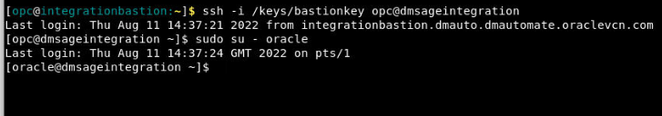
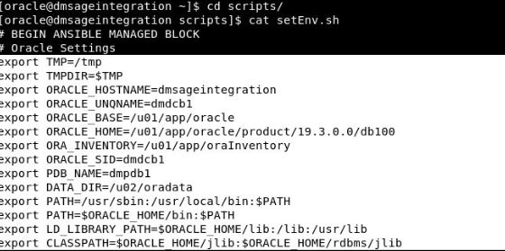

# Initialize Environment

## Introduction
In this lab we will setup the required database and GoldenGate replication for the Data Mesh Data Integration Demo.

*Estimated Lab Time*:  20 minutes

### Lab Architecture


### Objectives
Understanding how to prepare and setup an Oracle Database for replication and define users for replication. Users are created using scripts that populate the multitenant environment with required Oracle Users while applying aliases to be used by GoldenGate. The Database used in this lab are identified in the source and has been already created.

### Prerequisites
This lab assumes you have:
- A Free Tier, Paid or LiveLabs Oracle Cloud account
- You have completed:
    - Lab: Prepare Setup (*Free-tier* and *Paid Tenants* only)
    - Lab: Environment Setup
    - Lab: Initialize Environment


## Task 1: set up environment to populate truck streaming.

1. sign into the data integration server

2. Click on *Terminal* icon on the desktop to start a terminal session


3. [oracle@dmsageintegration ~]$ cd scripts


sudo into oracle user



4. change directory to scripts where the environment setup resides in a script

```
<copy>
cd  scripts
</copy>
```

```
<copy>
cd /home/oracle
oracle@dmsageintegration$ cd scripts/
</copy>
```
5. cat the setEnv shell script
```
<copy>
cat setEnv.sh
</copy>
```
6. copy and paste export lines to terminal . Press enter to set up environment



This will set up the Oracle environment


## Task 2: Run commands to populate Truck Stream inserts 


1. [oracle@dmsageintegration ~]$ cd ..


2.  run script to generate records in TruckStream database

```
<copy>
cd ..
</copy>
```

3. Run script to populate Truck Stream database with inserts

```
<copy>
[oracle@dmsageintegration ~]$ sh ./scripts/feed_integration_script.sh ./scripts/TruckStreamScript2.sql 1

</copy>
```


You may now [proceed to the next lab](#next).


## Learn More

* [GoldenGate Microservices](https://docs.oracle.com/en/middleware/goldengate/core/19.1/understanding/getting-started-oracle-goldengate.html#GUID-F317FD3B-5078-47BA-A4EC-8A138C36BD59)

## Acknowledgements
* **Author** - Brian Elliott, Data Integration, August - 2022
* **Contributors** - 
- **Last Updated By/Date** - Brian Elliott, Data Integration, August - 2022
