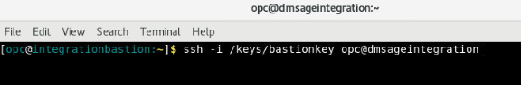

# Initialize Environment

## Introduction
In this lab we will setup the required database and GoldenGate replication users.

*Estimated Lab Time*:  10 minutes

### Lab Architecture


### Objectives
Understanding how to prepare and setup an Oracle Database for replication and define users for replication. Users are created using scripts that populate the multitenant environment with required Oracle Users while applying aliases to be used by GoldenGate. The Databases used in this lab are identified using the SOE schema in source and targets.


## Task 1: Validate That Required Processes are Up and Running.
1. Now with access to your remote desktop session, proceed as indicated below to validate your environment before you start executing the subsequent labs. The following Processes should be up and running:

    - Database Listener
        - LISTENER
    - Database Server instance
        - ORCL
    - Oracle GoldenGate ServiceManager

    Open the terminal on the remote desktop and run the following for a clean start.

    ```
    <copy>
    sudo systemctl status oracle-database OracleGoldenGate
    </copy>
    ```

## Task 2: Run commands to populated Truck Stream inserts 

1. Click on *Terminal* icon on the desktop to start a terminal and Create some additional tables that we will be using later in our labs for CDR purposes.


 truckstream1.png



2. [oracle@dmsageintegration ~]$ cd scripts/


truckstream1.png


truckstream2.png


```
<copy>
cd /home/oracle
oracle@dmsageintegration $ cd scripts/
</copy>
```

```
<copy>
cat setEnv.sh
</copy>
```


```
<copy>copy and  paste to terminal
</copy>
```

~~~
<copy>
export TMP=/tmp
export TMPDIR=$TMP
export ORACLE_HOSTNAME=dmsageintegration
export ORACLE_UNQNAME=dmdcb1
export ORACLE_BASE=/u01/app/oracle
export ORACLE_HOME=/u01/app/oracle/product/19.3.0.0/db100
export ORA_INVENTORY=/u01/app/oraInventory
export ORACLE_SID=dmdcb1
export PDB_NAME=dmpdb1
export DATA_DIR=/u02/oradata
export PATH=/usr/sbin:/usr/local/bin:$PATH
export PATH=$ORACLE_HOME/bin:$PATH
export LD_LIBRARY_PATH=$ORACLE_HOME/lib:/lib:/usr/lib
export CLASSPATH=$ORACLE_HOME/jlib:$ORACLE_HOME/rdbms/jlib

<copy>
```


```
</copy>
cd ..

[oracle@dmsageintegration ~]$ pwd
/home/oracle
[oracle@dmsageintegration ~]$ sh ./scripts/feed_integration_script.sh ./scripts/TruckStreamScript2.sql 

</copy>
```

Run:

```
<copy>
[oracle@dmsageintegration ~]$ sh ./scripts/feed_integration_script.sh ./scripts/TruckStreamScript2.sql 

</copy>
```


You may now [proceed to the next lab](#next).


## Learn More

* [GoldenGate Microservices](https://docs.oracle.com/en/middleware/goldengate/core/19.1/understanding/getting-started-oracle-goldengate.html#GUID-F317FD3B-5078-47BA-A4EC-8A138C36BD59)

## Acknowledgements
* **Author** - Brian Elliott, Data Integration, August 2022
* **Contributors** - 
- **Last Updated By/Date** - Brian Elliott, Data Integration, August 2022
